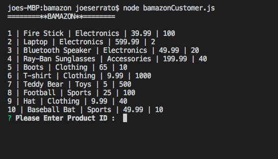
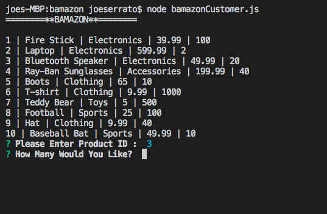
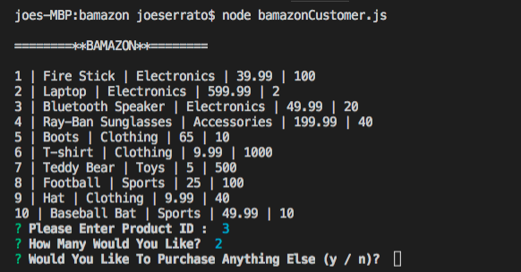
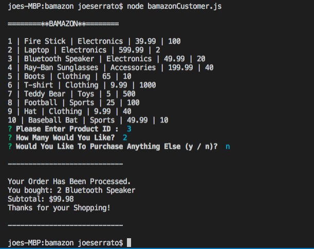
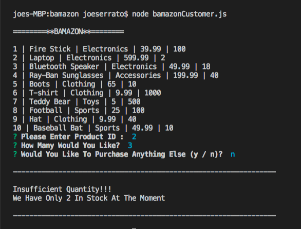

# bamazon

A node powered online shopping center.

To create this, you'll need to download the following node packages:

* mysql 
* inquirer

## Try It Yourself

1.Open up Your terminal.
2.Navigate to the folder that contains the bamazonCustomer.js file.

3.Node then displays the list of items in the databse.
4.Select which item you'd like to buy.

5.Enter quantity desired.

6.Type Y if you like to purchase something else or N if done.

7.If quantity desired is not in stock you will receive an error message.

